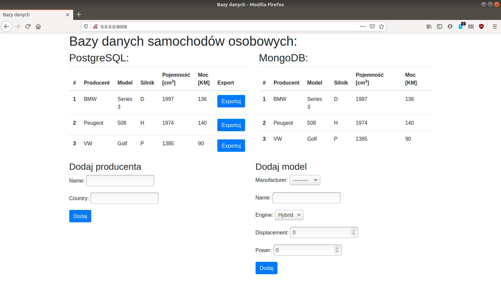

# Projekt: Eksport danych z PostgreSQL do MongoDB przy użyciu django-rest-framework

## Wymagania:
+ Docker
+ docker-compose

## Opis

W celu uruchomienia projektu należy uruchomic plik docker-compose.yml
W terminalu wpisujemy:
> docker-compose build

> docker-compose up

Po porawnym zbudowaniu obrazu i uruchomieniu będziemy mogli przejśc do dwóch stron:
+ [Interfejs użytkownika](http://0.0.0.0:8008)
+ [Panel MongoExpress](http://0.0.0.0:8081)

W interfejsie użytkownika pokazane są dwie tabele: PostgreSQL i MongoDB


Dodając producenta oraz model pojazdu rekord dodawany jest do PostgreSQL.
W celu eksportu do bazy MongoDB należy przy danym modelu wciśnąć przycisk "Exportuj".

Serializacja danych z PostgreSQL do formatu JSON odbywa sie przy pomocy biblioteki django-rest-framework.
+ [Link do API](http://0.0.0.0:8008/api)

W projekcie nie są wykorzystywane zapytania HTTP, lecz klasa CarSerializer (api/serializers.py).
Gdyby zapytanie miało się odbywać z osobnego serwisu można użyć do tego bardzo prostej biblioteki [requests](https://requests.readthedocs.io/en/master/).
Przykładowo:

```python
import requests

r = requests.get('http://0.0.0.0:8008/api/cars/1/')
data = r.json()
```
Wynik:
```javascript
{'manufacturer': 1, 'name': 'Series 3', 'engine': 'D', 'displacement': 1997, 'power': 136}
``` 